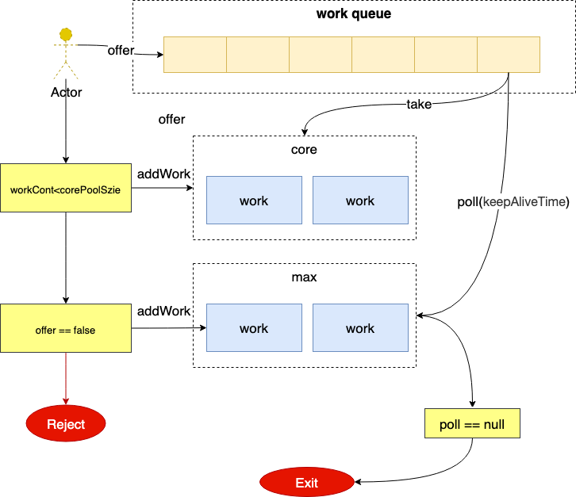
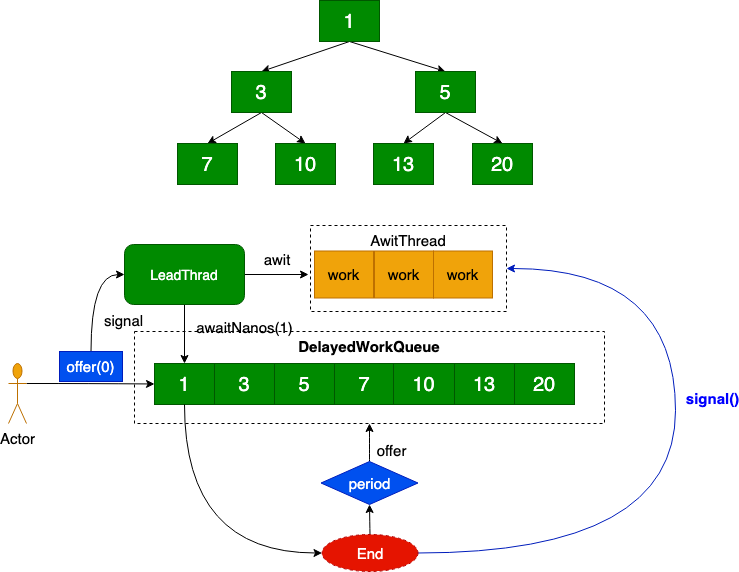
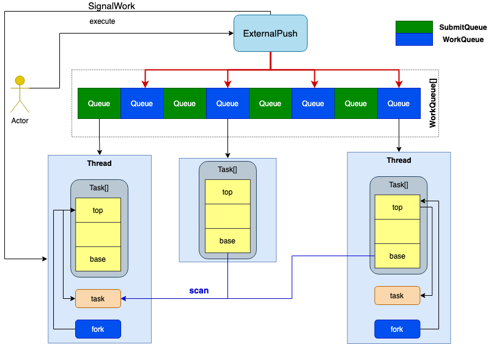

# JAVA

### 一. JUC

2. AQS

3. CountDownLatch

4. CyclicBarrier

5. ReadWriteLock

6. Semaphore

7. Exchanger

### 二. 单例模式

1. 饿汗式

   ```java
   public class SingleObject{
     private static final SingleObject INSTANCE = new SingleObject();
     
     private SingleObject(){}
    
     public static getInstace(){
       return INSTANCE;
     }
   }
   ```

   

2. double checked 

   ```java
   public class SingleObject {  
       private volatile static SingleObject singleton;  
       private SingleObject (){}  
       public static SingleObject getSingleton() {  
       if (singleton == null) {  
           synchronized (Singleton.class) {  
           if (singleton == null) {  
               singleton = new Singleton();  
           }  
           }  
       }  
       return singleton;  
       }  
   }
   ```

### 三. 引用类型

1. ##### 强引用  <font color="#FF0000">内存不够内存溢出</font>

   ```java
   // -Xms20M -Xmx20M
   public static void main(String[] args) {
           byte[] bytes = new byte[1024 * 1024 * 20];
           System.out.println(bytes);
    }
   // Exception in thread "main" java.lang.OutOfMemoryError: Java heap space
   ```

   

2. ##### 软引用  <font color="#FF0000">内存不够被回收</font>

   ```java
   // -Xms20M -Xmx20M
   public static void main(String[] args) throws InterruptedException {
           SoftReference<byte[]> softReference = new SoftReference<>(new byte[1024 * 1024 * 10]);
           System.out.println(softReference.get());
           System.gc();
   
           TimeUnit.MICROSECONDS.sleep(500);
   
           System.out.println(softReference.get());
   
           byte[] bytes = new byte[1024 * 1024 * 10];
   
           System.out.println(softReference.get());
   
       }
   //[B@574caa3f
   //[B@574caa3f
   //null
   ```

3. ##### 弱引用 <font color="#FF0000">GC 发生被回收</font>

   ```java
   // -Xms20M -Xmx20M
   public static void main(String[] args) {
           WeakReference<byte[]> softReference = new WeakReference<>(new byte[1024 * 1024 * 10]);
           System.out.println(softReference.get());
           System.gc();
           System.out.println(softReference.get());
   }
   //[B@574caa3f
   //null
   ```

   ThreadLocal

   - key应用存在内存泄漏用虚引用解决
   - value还是存在内存泄漏，ThreadLocal用完需要删除对象

4. ##### 虚引用 <font color="#FF0000">获取不到值  使用场景堆外内存</font>

   ```java
    public static void main(String[] args) throws InterruptedException {
   
           ReferenceQueue<byte[]> queue = new ReferenceQueue<>();
           PhantomReference<byte[]> softReference = new PhantomReference(new byte[1024 * 1024 * 10], queue);
           while (true) {
               Reference<? extends byte[]> poll = queue.poll();
               if (poll != null) {
                   System.out.println("gc 通知");
               }
           }
    }
   ```

### 四. 线程

1. ##### 创建线程的方法

   - 继承Thread
   - 继承Runable
   - 继承Callbable

2. ##### 线程状态

   ```java
    public enum State {
      NEW,      		 // 线程初始化，没有启动
      RUNNABLE, 		 // 可运行状态  1. running  2.Read
      BLOCKED, 		 // 被阻塞 synchronized  
      WAITING,      // 等待唤醒 o.wait() t.join() LockSupport.park() Lock.lock()
      TIMED_WAITING // 等待时间唤醒  Thread.sleep(time) o.wait(time) t.json(time)....
      TERMINATED;   // 线程结束
   }
   ```

3. 可见性，有序性 ，原子性

   


### 五. 线程池

​    $N_{threads}=N_{cpu} *U_{cpu} * (1 + W/C)$ 

​    预估线程= cpu核数* 使用率*（1 + 等待的时间/计算的时间）

​     2 = 1 * 100%  *（1+0.5/0.5）

1. #### ThreadPoolExecutor
  
   - corePoolSize
   - maximumPoolSize
   - keepAliveTime
   - TimeUnit
   - BlockingQueue
   - ThreadFactory
   - RejectedExecutionHandler
     1. Abort: 抛异常
     2. Discard：扔掉
     3. DiscardOldest：扔掉排队时间最久的
     4. CalleRuns：调用者处理任务
     
     
   
2. #### SheduledThreadPollExecutor
  
   ```
   左孩子的索引是 2*n+1
   右孩子的索引是 2*n+2
   父节点的索引是 (n - 1) / 2
   ```
   
   
   
   
   
   
   
3. #### ForkJoinPool

      

   


