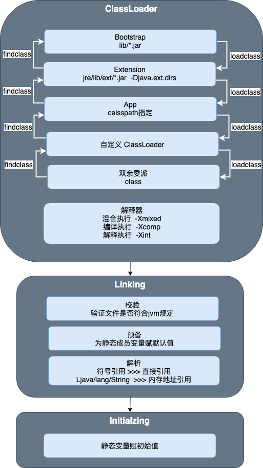

# JVM

## 1. **[ClassFile 结构](https://docs.oracle.com/javase/specs/jvms/se12/html/jvms-4.html#jvms-4.1)**

```
ClassFile {
    u4             magic;
    u2             minor_version;
    u2             major_version;
    u2             constant_pool_count;
    cp_info        constant_pool[constant_pool_count-1];
    u2             access_flags;
    u2             this_class;
    u2             super_class;
    u2             interfaces_count;
    u2             interfaces[interfaces_count];
    u2             fields_count;
    field_info     fields[fields_count];
    u2             methods_count;
    method_info    methods[methods_count];
    u2             attributes_count;
    attribute_info attributes[attributes_count];
}
```

- **constant_pool**
    
    ```
    cp_info {
        u1 tag;
        u1 info[];
    }
    ```
    
- **fields**
    
    ```
    field_info {
        u2             access_flags;
        u2             name_index;
        u2             descriptor_index;
        u2             attributes_count;
        attribute_info attributes[attributes_count];
    }
    ```
    
- **methods**
    
    ```
    method_info {  
      u2             access_flags;  
      u2             name_index;  
      u2             descriptor_index;  
      u2             attributes_count;    
      attribute_info attributes[attributes_count];
    }
    ```
    
- **attributes**
    
    ```
    attribute_info {   
     u2 attribute_name_index;   
     u4 attribute_length;    
     u1 info[attribute_length];
    }
    ```
    

## 2. 类加载-验证-初始化



- C**lassloadr**
    
    ```java
    public class Launcher {
      // BootClassPathHolder
       private static String bootClassPath = System.getProperty("sun.boot.class.path");
      // AppClassLoader
       final String var1 = System.getProperty("java.class.path");
      // ExtClassLoader
       String var0 = System.getProperty("java.ext.dirs");
    }
    ```
    
- 

## 3. JMM


[**MESI-intel](https://zh.wikipedia.org/wiki/MESI%E5%8D%8F%E8%AE%AE)（缓存一致性协议）**

任意一对缓存，对应缓存行的相容关系

[MESI](https://www.notion.so/c027fefbef15440cb690b02edcf0d7da)

### **cache line**

```markdown
|M/E/S/I（2位） | cache line data |
```

## 4. 运行数据区

- 本地方法栈（Native Method Stack）
    - 本地方法通过JNI访问虚拟机运行时的数据区
- 程序计数器（PC）
    - 记录程序执行位置
- 虚拟机栈（JVM Stack）
    
    Frame - 方法栈针（main方法）
    
    - 局部向量表（Local Variable Table）
    - 操作栈（Operand Stack）
    - 动态链接（Dynamic Linking）
    - 返回地址（return address）
- 堆区(Heap)
    - 对象实例
- 元空间(Metaspace)
    - 元数据-class
    - 字符常量池1.7 永久代，1.8 堆

## 5. GC常用算法和收集器

- 寻找垃圾
    1. 引用计算（不能解决循环引用）
    2. 根可达
        - GC Roots
            1. 虚拟机栈(栈桢中本地变量表)中引用的对象
            2. 静态变量引用的对象
            3. 常量引用的对象
            4. JNI引用的对象
- GC常用算法
    1. 标记清除（Mark-Sweep）
    2. 拷贝（copying）
    3. 标记压缩（Mark-Compact）

## 6. 常见垃圾收集器

- Serial 年轻代  串行回收
    
    
    
- Parallel Scavenge年轻代   并行回收
    
    
    
- SerialOld
- ParallelOld
- ParNew(Parallel Scavenge增强配合CMS使用)
- CMS(ConcurrentMarkSweep )
    
    
    
    问题
    
    1. 内存的碎片化
    2. 浮动垃圾
- G1
    
    
    
    
    
    三色标记
    
    1. 黑色标记（自己已经标记，fields都标记完成）
    2. 灰色标记（自己已经标记，fields还没有标记）
    3. 白色标记（还没有标记完成）
    
    YGC
    Mixed GC
    FULL GC
    
    STAB
    
- ZGC
- Shenandoah
    
    默认 PS + ParallelOld
    
    [常用垃圾收组合](https://www.notion.so/9e946bed716c4cd18b7325056c4f6de7)
    
- 默认GC查看
    - -XX:+PrintCommandLineFlags -version
    - -XX:+PrintGC
- 调优
    - 吞吐量：用户程序时间/(用户程序的时间+ 垃圾回收时间)
    - 响应时间：垃圾回收时间越短。

## 7. 常用命令分析

- CUP
    1. 先执行top ，找到CPU占用比较高的进程
        
        ```powershell
        top
        ```
        
    2. jstack 进程ID
        
        ```powershell
        jstack 进程ID  >show.txt
        ```
        
    3. 找到经常中cpu占用比较高的线程，线程Id转为16进制
        
        ```powershell
        top  -Hp 进程ID ## 查看进程中的线程情况
        ```
        
    4. 通过线程ID查找线程情况
- 内存
    1. 查看map
        
        ```powershell
        jmap -histo pid | head - number
        ```
        
    2.  dump
        
        ```powershell
        jmap -dump:format=b,file=/var/logs/heap.hprof pid
        ```
        
- 进程参数
    
    ```powershell
    jinfo 进程ID
    ```
    
- 监控gc信息
    
    ```powershell
    jstack -gc 进程ID 毫秒
    ```
    
- jconsole远程连接
    
    ```powershell
    -Djava.rmi.server.hostname=192.160.0.8 #远程服务器ip，即本机ip
    -Dcom.sun.management.jmxremote #允许JMX远程调用
    -Dcom.sun.management.jmxremote.port=5000 #自定义jmx 端口号
    -Dcom.sun.management.jmxremote.ssl=false # 是否需要ssl 安全连接方式
    -Dcom.sun.management.jmxremote.authenticate=false #是否需要秘钥
    
    #spring boot 
    ENV JAVA_TOOL_OPTIONS "-Dcom.sun.management.jmxremote.ssl=false \
     -Dcom.sun.management.jmxremote.authenticate=false \
     -Dcom.sun.management.jmxremote.port=5000 \
     -Dcom.sun.management.jmxremote.rmi.port=5000 \
     -Dcom.sun.management.jmxremote.host=0.0.0.0 \
     -Djava.rmi.server.hostname=0.0.0.0"`
    ```
    
- jprofiler(收费)
    
    [Java Profiler - JProfiler](https://www.ej-technologies.com/products/jprofiler/overview.html)
    
- 

## 8. 参数

- GC常用参数
    
    ```powershell
    # 年轻代 最小堆 最大堆 栈空间
    -Xmn -Xms -Xmx -Xss
    # 使用TLAB 默认打开
    -XX:+UseTLAB
    # 打印TLAB使用情况
    -XX:+PrintTLAB
    # 设置TLAB大小
    -XX:TLABSize 
    # 禁用FGC
    -XX:+DisableExplictGC
    # 打印GC信息
    -XX:+PrintGC
    # 打印GC详细信息
    -XX:+PrintGCDetails
    # GC 打印堆栈情况
    -XX:+PrintHeapAtGC
    # 打印JVM参数
    -XX:+PrintVMOptions
    # 初始化的默认值
    java -XX:+PrintFlagsFinal +XX:+PrintFlagsInitial
    # GC 日志文件
    -Xloggc:opt/log/gc.log
    # GC 升级代年龄,最大值15
    -XX:MaxTenuringThreshold=15
    ```
    
- Parallel常用参数
    
    ```powershell
    # Survivor(2个)与Eden区的大小比值 2:8
    -XX:SurvivorRation=8
    ```
    

- G1常用参数
    
    ```powershell
    -XX:+UseG1GC
    # 设置G1收集过程目标时间，默认值200ms，不是硬性条件
    -XX:MaxGCPauseMillis 
    # 设置Region大小，并非最终值 1M,2M,3M,4M,8M,16M,32M 
    -XX:G1HeapRegionSize=n
    # 新生代最小值，默认值5%
    -XX:G1NewSizePercent
    # 新生代最大值，默认值60%
    -XX:G1MaxNewSizePercent
    # STW期间，并行GC线程数
    -XX:ParallelGCThreads
    # 并发标记阶段，并行执行的线程数
    -XX:ConcGCThreads=n
    # 设置触发标记周期的 Java 堆占用率阈值。默认值是45%。这里的java堆占比指的是non_young_capacity_bytes，包括old+humongous
    -XX:InitiatingHeapOccupancyPercent
    ```
    

## 9. 引用

[Getting Started with the G1 Garbage Collector](https://www.oracle.com/webfolder/technetwork/tutorials/obe/java/G1GettingStarted/index.html)

[Java Hotspot G1 GC的一些关键技术](https://tech.meituan.com/2016/09/23/g1.html)