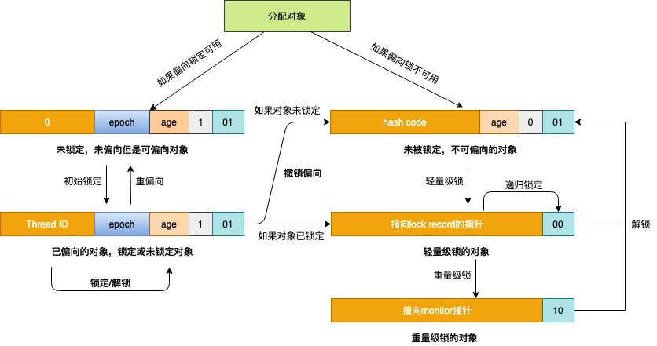
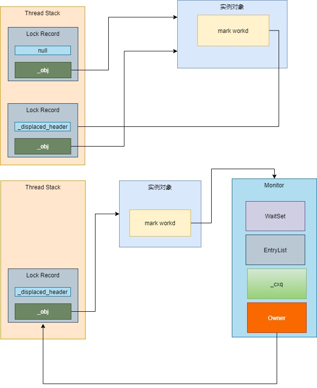
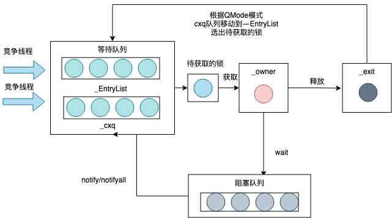

# Synchronized

​        Synchronized 使用监视器实现的。Java中的每个对象都与一个监视器关联,线程可以锁定和解锁监视器。一次只能有一个线程在监视器上保持锁。任何其他试图锁定该监视器的线程都将被阻止，直到它们可以在该监视器上获得锁定为止。

1. ### 用法

   <table>
   <tr>
       <th>锁的对象</th>
       <th>具体位置</th>
       <th>伪代码</th>  
   </tr >
   <tr >
    <td rowspan="3">Object</td>
       <td>方法</td>
       <td>public synchronized void method() {   ......   }</td>
   </tr>
   <tr>
       <td>代码块</td>
       <td>public void method() {   synchronized (this) {  ......   } }</td>
   </tr>
   <tr>
       <td>代码块</td>
       <td>public void method() {   synchronized (object) { ......  } }</td>
   </tr>
   <tr>
       <td rowspan="3">Class</td>
       <td >方法</td>
       <td >public static synchronized void method() {  ......}</td>
   </tr>
   <tr>
       <td >代码块</td>
       <td >public void method() {     synchronized (SynchronizedDemo.class) {  ......   } }</td>
   </tr>
   </table>    

2. ### 锁的实现

   1. 查看方法上的锁，通过反编译查看字节码

      ```java
          public int i = 0;
      
          public synchronized void add() {
              i++;
          }
      ```

      ```
        public synchronized void add();
          descriptor: ()V
          flags: ACC_PUBLIC, ACC_SYNCHRONIZED
          Code:
            stack=3, locals=1, args_size=1
               0: aload_0
               1: dup
               2: getfield      #2                  // Field i:I
               5: iconst_1
               6: iadd
               7: putfield      #2                  // Field i:I
              10: return
      ```

      flags里面有一个`ACC_SYNCHRONIZED`标志,这个标识表示JVM是同步方法

   2. 同步代码块的锁

      ```java
      public int i = 0;
      public void decrement() {
              synchronized (this) {
                  i--;
              }
      }
      ```

      ```
        public void decrement();
          descriptor: ()V
          flags: ACC_PUBLIC
          Code:
            stack=3, locals=3, args_size=1
               0: aload_0
               1: dup
               2: astore_1
               3: monitorenter
               4: aload_0
               5: dup
               6: getfield      #2                  // Field i:I
               9: iconst_1
              10: isub
              11: putfield      #2                  // Field i:I
              14: aload_1
              15: monitorexit
              16: goto          24
              19: astore_2
              20: aload_1
              21: monitorexit
              22: aload_2
              23: athrow
              24: return
      
      ```

      同步方法使用了 monitorenter上锁，monitorexit解锁 第二个monitorexit是抛出异常后解锁


3. ### Java对象信息

   <table>
   <thead>
     <tr>
       <th colspan="3">JAVA实例对象</th>
     </tr>
   </thead>
   <tbody>
     <tr>
       <td rowspan="2">对象头</td>
       <td><a href="https://github.com/openjdk/jdk8u/blob/4a4236a366eeb961baf157f0938634c1647c447f/hotspot/src/share/vm/oops/markOop.hpp#L37">mark word</a></td>
       <td>锁,年龄,hashcode,线程ID ...</td>
     </tr>
     <tr>
       <td><a href="https://github.com/openjdk/jdk8u/blob/4a4236a366eeb961baf157f0938634c1647c447f/hotspot/src/share/vm/oops/klass.hpp#L97">klass word</a></td>
       <td>32位存放32bit</br>64位默认开启指针压缩是32bit 不开启是64bit</br>
   开启 -XX:+UseCompressedOops</br> 关闭 -XX:-UseCompressedOops</br></td>
     </tr>
     <tr>
       <td>实例数据</td>
       <td colspan="2">Java自定义字段，参数类型的长度</td>
     </tr>
     <tr>
       <td>对齐填充</td>
       <td colspan="2">对象间默认按照8byte对齐，对齐则不需要padding，</br>否则需要padding补充8byte对齐</td>
     </tr>
   </tbody>
   </table>    

   - ##### Ordinary Object Pointers（[OOPs](https://github.com/openjdk/jdk8u/blob/4a4236a366eeb961baf157f0938634c1647c447f/hotspot/src/share/vm/oops/oop.hpp#L59)）普通对象指针

     oopDesc 使用了以下信息描述指针:
     
     ``` c++
     class oopDesc {
       friend class VMStructs;
      private:
       // mark word
       volatile markOop  _mark;
       // klass word
       union _metadata {
         Klass*      _klass;
         narrowKlass _compressed_klass;
       } _metadata;
     ```
     
        #### 64位 mark word 格式如下：
     <table align="center">
         <thead>
       <tr>
           <th rowspan="2">锁状态</th>
           <th colspan="4">57bit</th>
             <th rowspan="2">4bit</th>
             <th>1bit</th>
           <th>2bit</th>
         </tr>
           <tr>
             <td>25bit</td>
           <td>29bit</td>
           <td>2bit</td>
             <td>1bit</td>
             <td>是否偏向锁</td>
           <td>锁标识位</td>
         </tr>
         </thead>
         <tbody>
           <tr>
           <td>无锁</td>
           <td>25位未使用</td>
             <td colspan="2">31位hasecode</td>
             <td>1位未使用</td>
           <td>对象的分带年龄</td>
           <td>0</td>
           <td>01</td>
           </tr>
           <tr>
             <td>偏向锁</td>
             <td colspan="2">54位线程ID</td>
             <td>2位epoch</td>
             <td>1位未使用</td>
             <td>对象分带年龄</td>
             <td>1</td>
             <td>01</td>
           </tr>
           <tr>
             <td>轻量级锁</td>
             <td colspan="6">指向栈中记录的指针62位</td>
             <td>00</td
           </tr>
           <tr>
             <td>重量级锁</td>
             <td colspan="6">指向重量级锁的指针62位</td>
             <td>10</td>
           </tr>
           <tr>
             <td>GC标记</td>
             <td colspan="6">空</td>
             <td>11</td>
           </tr>
         </tbody>
     </table>
     
     

4. ### 锁优化

	  [锁状态转换的流程图](https://wiki.openjdk.java.net/display/HotSpot/Synchronization): 

    

   

1. #### Lock Record（[锁记录](https://github.com/openjdk/jdk8u/blob/4a4236a366eeb961baf157f0938634c1647c447f/hotspot/src/share/vm/runtime/basicLock.hpp#L57)）
   
    当字节码解释器执行 monitorenter 字节码轻量级锁锁住一个对象时，就会在获取锁的线程的栈上显式或者隐式分配一个 Lock Record 空间。
   
    ```c++
      class BasicLock VALUE_OBJ_CLASS_SPEC {
        friend class VMStructs;
        private:
        volatile markOop _displaced_header;  // 被锁的对象头信息
      }
      class BasicObjectLock VALUE_OBJ_CLASS_SPEC {
       friend class VMStructs;
        private:
        BasicLock _lock;
        oop       _obj; // 持有锁线程对象   
      }
      
    ```
   
    
   
   2. #### 偏向锁
   
      ​		在大多数情况下，锁不仅不存在多线程竞争，而且总是由同一线程多次获得，为了让线程获得锁的代价更低，引进了偏向锁
   
      ```powershell
      #偏向锁默认是在程序启动4秒后才激活，
      #开启偏向锁 
      -XX:+UseBiasedLocking -XX:BiasedLockingStartupDelay=0 
      #关闭变向锁
      -XX:-UseBiasedLocking
      ```
   
         #####  偏向锁的获取 [bytecodeInterpreter.cpp](https://github.com/openjdk/jdk8u/blob/4a4236a366eeb961baf157f0938634c1647c447f/hotspot/src/share/vm/interpreter/bytecodeInterpreter.cpp#L1814)
   
      ```c++
      CASE(_monitorenter): {
        // 锁对象
         oop lockee = STACK_OBJECT(-1);
             // 获取锁记录
              BasicObjectLock* limit = istate->monitor_base();
              BasicObjectLock* most_recent = (BasicObjectLock*) istate->stack_base();
              BasicObjectLock* entry = NULL;
              while (most_recent != limit ) {
                if (most_recent->obj() == NULL) entry = most_recent;
                else if (most_recent->obj() == lockee) break;
                most_recent++;
              }
              // 成功分配一个lock record
              if (entry != NULL) {
                // 将lock record的Object 指针指向锁对象
                entry->set_obj(lockee);
                int success = false;
                // 读取class中的epoch值
                uintptr_t epoch_mask_in_place =(uintptr_t)markOopDesc::epoch_mask_in_place;
                // 对象的mark word
                markOop mark = lockee->mark();
                intptr_t hash = (intptr_t) markOopDesc::no_hash;
                // 如果锁对象是偏向模式
               if (mark->has_bias_pattern()) {
                  uintptr_t thread_ident;
                  uintptr_t anticipated_bias_locking_value;
                  thread_ident = (uintptr_t)istate->thread();
                 // 判断是否获取偏向锁
                 // (uintptr_t)lockee->klass()->prototype_header() 
                 // class 对象头信息
                 // 偏向     epoch            线程ID
                 // 00000101 00000001 00000000 ... 00000000  klass的对象头
                 // 00000101 00000001 10010001 ... 10010001  or 线程ID
                 // 00001101 00000001 10010001 ... 10010001  实例对象头
                 // 00001000 00000000 00000000 ... 00000000  异或操作只剩分带年龄
                 // 01110000 00000000 00000000 ... 00000000  年龄去and 
                 // 00000000 00000000 00000000 ... 00000000  线程相同最终返回成功
                  anticipated_bias_locking_value =
                    (((uintptr_t)lockee->klass()->prototype_header() | thread_ident) ^ (uintptr_t)mark) &
                    ~((uintptr_t) markOopDesc::age_mask_in_place);
                 // 已偏向当前线程 成功获取偏向锁
                  if  (anticipated_bias_locking_value == 0) {
                    success = true;
                  }
                   // 如果偏向模式关闭，则尝试撤销偏向锁
                   else if((anticipated_bias_locking_value&
                            markOopDesc::biased_lock_mask_in_place)  != 0) { 
                     ........
                   }
                   // 如果epoch不等于class中的epoch，则尝试重偏向
                   else if ((anticipated_bias_locking_value & epoch_mask_in_place) !=0)              { 
                     .......
                   } else {
                    // 匿名偏向的mark word，尝试用CAS指令替换掉锁对象的mark word
                    markOop header = (markOop) ((uintptr_t) mark 
                    &((uintptr_t)markOopDesc::biased_lock_mask_in_place 
       							|(uintptr_t)markOopDesc::age_mask_in_place 
                    | epoch_mask_in_place));
                    if (hash != markOopDesc::no_hash) {
                        header = header->copy_set_hash(hash);
                    }
                    // 行的对象头信息
                    markOop new_header = (markOop) ((uintptr_t) header | thread_ident);
                    // 替换对象头信息
                    if (Atomic::cmpxchg_ptr((void*)new_header, 
                                            lockee->mark_addr(), header) == header) {
                      if (PrintBiasedLockingStatistics)
                        (* BiasedLocking::anonymously_biased_lock_entry_count_addr())++;
                     }
                    else {
                      // 如果修改失败说明存在多线程竞争，所以进入monitorenter方法
                       CALL_VM(InterpreterRuntime::monitorenter(
                         THREAD, entry),handle_exception);
                    }
                     success = true;
                   }
               }
      }
      ```
   
      ##### 偏向锁重偏向 [bytecodeInterpreter.cpp](https://github.com/openjdk/jdk8u/blob/4a4236a366eeb961baf157f0938634c1647c447f/hotspot/src/share/vm/interpreter/bytecodeInterpreter.cpp#L1867)
   
      如果epoch已过期，则需要重偏向
   
      ``` c++
      // 如果epoch不等于class中的epoch，则尝试重偏向
      else if ((anticipated_bias_locking_value & epoch_mask_in_place) !=0) {
        // 构造一个偏向当前线程的mark word
         markOop new_header = (markOop) ( (intptr_t) lockee->klass()->prototype_header() | thread_ident);
         if (hash != markOopDesc::no_hash) {
           new_header = new_header->copy_set_hash(hash);
         }
        // CAS替换对象头的mark word  
         if (Atomic::cmpxchg_ptr((void*)new_header, lockee->mark_addr(), mark) == mark)    {
             if (PrintBiasedLockingStatistics)
             (* BiasedLocking::rebiased_lock_entry_count_addr())++;
         }
         else {
          // 重偏向失败，代表存在多线程竞争，则调用monitorenter方法进行锁升级
           CALL_VM(InterpreterRuntime::monitorenter(THREAD, entry), handle_exception);
         }
         success = true;
       }
      ```
   
      ##### 偏向锁重的撤销 [interpreterRuntime.cpp](https://github.com/openjdk/jdk8u/blob/4a4236a366eeb961baf157f0938634c1647c447f/hotspot/src/share/vm/interpreter/interpreterRuntime.cpp#L620)
   
      ```c++
      IRT_ENTRY_NO_ASYNC(void, InterpreterRuntime::monitorenter(JavaThread* thread, BasicObjectLock* elem)){
        // 如果开启了偏向锁 走fast_enter方法
       if (UseBiasedLocking) {
          // Retry fast entry if bias is revoked to avoid unnecessary inflation
          ObjectSynchronizer::fast_enter(h_obj, elem->lock(), true, CHECK);
        } else {
          ObjectSynchronizer::slow_enter(h_obj, elem->lock(), CHECK);
        }
      }
      ```
   
       [ObjectSynchronizer::fast_enter](https://github.com/openjdk/jdk8u/blob/4a4236a366eeb961baf157f0938634c1647c447f/hotspot/src/share/vm/runtime/synchronizer.cpp#L169)
   
      ```c++
      void ObjectSynchronizer::fast_enter(Handle obj, BasicLock* lock, bool attempt_rebias, TRAPS) {
       if (UseBiasedLocking) {
          if (!SafepointSynchronize::is_at_safepoint()) {
            // 撤销和重偏向
            BiasedLocking::Condition cond = BiasedLocking::revoke_and_rebias(obj, attempt_rebias, THREAD);
            if (cond == BiasedLocking::BIAS_REVOKED_AND_REBIASED) {
              return;
            }
          } else {
            assert(!attempt_rebias, "can not rebias toward VM thread");
            // 安全撤销
            BiasedLocking::revoke_at_safepoint(obj);
          }
          assert(!obj->mark()->has_bias_pattern(), "biases should be revoked by now");
       }
      
       slow_enter (obj, lock, THREAD) ;
      }
      ```
   
      [BiasedLocking::revoke_and_rebias](https://github.com/openjdk/jdk8u/blob/4a4236a366eeb961baf157f0938634c1647c447f/hotspot/src/share/vm/runtime/biasedLocking.cpp#L554) 
      [BiasedLocking::revoke_at_safepoint](https://github.com/openjdk/jdk8u/blob/4a4236a366eeb961baf157f0938634c1647c447f/hotspot/src/share/vm/runtime/biasedLocking.cpp#L149)
   
      ```c++
      static BiasedLocking::Condition revoke_bias(oop obj, bool allow_rebias, bool is_bulk, JavaThread* requesting_thread, JavaThread** biased_locker) {
          ........
        uint age = mark->age();
        // 构建两个mark word，一个是匿名偏向模式（101），一个是无锁模式（001）
       markOop biased_prototype = markOopDesc::biased_locking_prototype()->set_age(age);
       markOop unbiased_prototype = markOopDesc::prototype()->set_age(age);
        
        JavaThread* biased_thread = mark->biased_locker();
        if (biased_thread == NULL) {
          // 对象匿名偏向 如果我们走到这里
          // 取消了偏向锁因为我们调用了hash code
          if (!allow_rebias) {
            obj->set_mark(unbiased_prototype);
          }
          if (TraceBiasedLocking && (Verbose || !is_bulk)) {
            tty->print_cr("  Revoked bias of anonymously-biased object");
          }
          return BiasedLocking::BIAS_REVOKED;
        }
        // 判读偏向线程是否存活
        bool thread_is_alive = false;
        // 如果当前线程就是偏向线程 
        if (requesting_thread == biased_thread) {
          thread_is_alive = true;
        } else {
         // 遍历当前jvm的所有线程，如果能找到，则说明偏向的线程还存活
          for (JavaThread* cur_thread = Threads::first(); cur_thread != NULL; cur_thread = cur_thread->next()) {
            if (cur_thread == biased_thread) {
              thread_is_alive = true;
              break;
            }
          }
        }
         // 如果偏向的线程已经不存活了
         if (!thread_is_alive) {
          if (allow_rebias) {
            obj->set_mark(biased_prototype);
          } else {
            obj->set_mark(unbiased_prototype);
          }
          // 允许重偏向则将对象mark word设置为匿名偏向状态，否则设置为无锁状态
          if (TraceBiasedLocking && (Verbose || !is_bulk)) {
            tty->print_cr("  Revoked bias of object biased toward dead thread");
          }
          return BiasedLocking::BIAS_REVOKED;
        }
        // 线程还存活则遍历线程栈中所有的Lock Record
        GrowableArray<MonitorInfo*>* cached_monitor_info =get_or_compute_monitor_info
                                                                        (biased_thread);
        BasicLock* highest_lock = NULL;
        for (int i = 0; i < cached_monitor_info->length(); i++) {
          MonitorInfo* mon_info = cached_monitor_info->at(i);
          // 如果能找到对应的Lock Record说明偏向的线程还在执行同步代码块中的代码
          if (mon_info->owner() == obj) {
            if (TraceBiasedLocking && Verbose) {
             ......
            // Assume recursive case and fix up highest lock later
            // 第一次锁记录设置为null
            markOop mark = markOopDesc::encode((BasicLock*) NULL);
            highest_lock = mon_info->lock();
            highest_lock->set_displaced_header(mark);
          } else {
            if (TraceBiasedLocking && Verbose) {
              tty->print_cr("   mon_info->owner (" PTR_FORMAT ") != obj (" PTR_FORMAT ")",
                            p2i((void *) mon_info->owner()),
                            p2i((void *) obj));
            }
          }
        }
        if (highest_lock != NULL) {
          // 修改第一个Lock Record为无锁状态，然后将obj的mark word设置为指向该Lock Record的指针
          highest_lock->set_displaced_header(unbiased_prototype);
          obj->release_set_mark(markOopDesc::encode(highest_lock));
          assert(!obj->mark()->has_bias_pattern(), "illegal mark state: stack lock used bias bit");
          if (TraceBiasedLocking && (Verbose || !is_bulk)) {
            tty->print_cr("  Revoked bias of currently-locked object");
          }
        } else {
          // 偏向锁已经不再同步代码块中了
          if (TraceBiasedLocking && (Verbose || !is_bulk)) {
            tty->print_cr("  Revoked bias of currently-unlocked object");
          }
          if (allow_rebias) {
            //设置为匿名偏向状态
            obj->set_mark(biased_prototype);
          } else {
            // 将mark word设置为无锁状态
            obj->set_mark(unbiased_prototype);
          }
      }
      ```
   
      
   
   3. #### 轻量级锁
   
      ##### 轻量级锁的获取 [bytecodeInterpreter.cpp](https://github.com/openjdk/jdk8u/blob/4a4236a366eeb961baf157f0938634c1647c447f/hotspot/src/share/vm/interpreter/bytecodeInterpreter.cpp#L1903)
   
      ```c++
      CASE(_monitorenter): {
      ..........
       // 轻量级锁重入逻辑
      if (!success) {
         // 构建一个无锁状态的Displaced Mark Word
         markOop displaced = lockee->mark()->set_unlocked();
         entry->lock()->set_displaced_header(displaced);
         // 如果指定了-XX:+UseHeavyMonitors，则call_vm=true，代表禁用偏向锁和轻量级锁
         bool call_vm = UseHeavyMonitors;
         // 利用CAS将对象头的mark word替换为指向Lock Record的指针
        if (call_vm || Atomic::cmpxchg_ptr(entry, lockee->mark_addr(), displaced) != displaced) {
        // 判断是不是锁重入
        if (!call_vm && THREAD->is_lock_owned((address) displaced->clear_lock_bits())) {
            // 如果是锁重入，则直接将Displaced Mark Word设置为nul
            entry->lock()->set_displaced_header(NULL);
        } else {
            CALL_VM(InterpreterRuntime::monitorenter(THREAD, entry), handle_exception);
        }
      }
      }
      ```
   
      ```c++
      IRT_ENTRY_NO_ASYNC(void, InterpreterRuntime::monitorenter(JavaThread* thread, BasicObjectLock* elem)){
        // 如果开启了偏向锁 走fast_enter方法
       if (UseBiasedLocking) {
          // Retry fast entry if bias is revoked to avoid unnecessary inflation
          ObjectSynchronizer::fast_enter(h_obj, elem->lock(), true, CHECK);
        } else {
          ObjectSynchronizer::slow_enter(h_obj, elem->lock(), CHECK);
        }
      }
      ```
   
      关闭了偏向锁直接进入轻量级锁 [ObjectSynchronizer::slow_enter](https://github.com/openjdk/jdk8u/blob/4a4236a366eeb961baf157f0938634c1647c447f/hotspot/src/share/vm/runtime/synchronizer.cpp#L227)
   
       ```c++
      void ObjectSynchronizer::slow_enter(Handle obj, BasicLock* lock, TRAPS) {
        markOop mark = obj->mark();
        // 如果是无锁状态
        if (mark->is_neutral()) {
          // Anticipate successful CAS -- the ST of the displaced mark must
          // be visible <= the ST performed by the CAS.
          // 设置Displaced Mark Word并替换对象头的mark word
          lock->set_displaced_header(mark);
          if (mark == (markOop) Atomic::cmpxchg_ptr(lock, obj()->mark_addr(), mark)) {
            TEVENT (slow_enter: release stacklock) ;
            return ;
          }
          // Fall through to inflate() ...
        } else if (mark->has_locker() && THREAD->is_lock_owned((address)mark->locker()))   {
          // 如果是重入，则设置Displaced Mark Word为null
          lock->set_displaced_header(NULL);
          return;
        }
        // 锁膨胀进入重量级锁
        lock->set_displaced_header(markOopDesc::unused_mark());
        ObjectSynchronizer::inflate(THREAD, obj())->enter(THREAD);
      }
       ```
   
      ##### 轻量级锁的退出
   
      [ObjectSynchronizer::slow_exit](https://github.com/openjdk/jdk8u/blob/4a4236a366eeb961baf157f0938634c1647c447f/hotspot/src/share/vm/runtime/synchronizer.cpp#L268)
   
      ```c++
      void ObjectSynchronizer::slow_exit(oop object, BasicLock* lock, TRAPS) {
        fast_exit (object, lock, THREAD) ;
      }
      void ObjectSynchronizer::fast_exit(oop object, BasicLock* lock, TRAPS) {
        markOop dhw = lock->displaced_header();
        markOop mark ;
        if (dhw == NULL) {
           // 重入锁
           // Recursive stack-lock.
           // Diagnostics -- Could be: stack-locked, inflating, inflated.
           mark = object->mark() ;
      	 ......
           if (mark->has_monitor()) {
              ObjectMonitor * m = mark->monitor() ;
           }
           return ;
        }
        mark = object->mark() ;
      
        // If the object is stack-locked by the current thread, try to
        // swing the displaced header from the box back to the mark.
        if (mark == (markOop) lock) {
           assert (dhw->is_neutral(), "invariant") ;
           if ((markOop) Atomic::cmpxchg_ptr (dhw, object->mark_addr(), mark) == mark) {
              TEVENT (fast_exit: release stacklock) ;
              return;
           }
        }
      ```
   
   4. #### 重量级锁
   
      
   
      [ObjectMonitor](https://github.com/openjdk/jdk8u/blob/4a4236a366eeb961baf157f0938634c1647c447f/hotspot/src/share/vm/runtime/objectMonitor.hpp#L137)
   
      ```
        ObjectMonitor() {
          _header       = NULL;
          _count        = 0;
          _waiters      = 0,    // 等待中的线程数
          _recursions   = 0;    // 线程重入次数
          _object       = NULL; // 存储该 monitor 的对象
          _owner        = NULL; // 指向拥有该 monitor 的线程
          _WaitSet      = NULL; // 等待线程 双向循环链表_WaitSet 指向第一个节点
          _WaitSetLock  = 0 ;
          _Responsible  = NULL ;
          _succ         = NULL ;
          _cxq          = NULL ;// 多线程竞争锁时的单向链表
          FreeNext      = NULL ;
          _EntryList    = NULL ;// _owner 从该双向循环链表中唤醒线程，
          _SpinFreq     = 0 ;
          _SpinClock    = 0 ;
          OwnerIsThread = 0 ;
          _previous_owner_tid = 0;// 前一个拥有此监视器的线程 ID
       }
      ```
   
      ##### 锁膨胀为重量级锁[ObjectSynchronizer::inflate](https://github.com/openjdk/jdk8u/blob/4a4236a366eeb961baf157f0938634c1647c447f/hotspot/src/share/vm/runtime/synchronizer.cpp#L1211)
   
      ```c++
       ObjectMonitor * ATTR ObjectSynchronizer::inflate (Thread * Self, oop object) {
        .......
        for (;;) {
            const markOop mark = object->mark() ;
            assert (!mark->has_bias_pattern(), "invariant") ;
      
            // The mark can be in one of the following states:
            // *  Inflated(重量级锁状态）    - just return
            // *  Stack-locked（轻量级锁状态）- coerce it to inflated
            // *  INFLATING（膨胀中）        - busy wait for conversion to complete
            // *  Neutral（无锁状态）        - aggressively inflate the object.
            // *  BIASED（偏向锁）           - Illegal.  We should never see this
      
            // CASE: inflated
            if (mark->has_monitor()) {
                // 重量级状态
                ObjectMonitor * inf = mark->monitor() ;
                .......
                return inf ;
            }
             // 只有该线程才能完成膨胀 其他线程必须等待
            if (mark == markOopDesc::INFLATING()) {
              
               TEVENT (Inflate: spin while INFLATING) ;
              // 在该方法中会进行spin/yield/park等操作完成自旋动作 
               ReadStableMark(object) ;
               continue ;
            }
      
            if (mark->has_locker()) {
                // 当前轻量级锁状态，先分配一个ObjectMonitor对象，并初始化值
                ObjectMonitor * m = omAlloc (Self) ;
                // Optimistically prepare the objectmonitor - anticipate successful CAS
                // We do this before the CAS in order to minimize the length of time
                // in which INFLATING appears in the mark.
                m->Recycle();
                m->_Responsible  = NULL ;
                m->OwnerIsThread = 0 ;
                m->_recursions   = 0 ;
                m->_SpinDuration = ObjectMonitor::Knob_SpinLimit ;
                // 将锁对象的mark word设置为INFLATING (0)状态 
                markOop cmp = (markOop) Atomic::cmpxchg_ptr (markOopDesc::INFLATING(), object->mark_addr(), mark) ;
                if (cmp != mark) {
                   omRelease (Self, m, true) ;
                   continue ;       // Interference -- just retry
                }
                markOop dmw = mark->displaced_mark_helper() ;
                assert (dmw->is_neutral(), "invariant") ;
      
                // Setup monitor fields to proper values -- prepare the monitor
                m->set_header(dmw) ;
                m->set_owner(mark->locker());
                m->set_object(object);
                guarantee (object->mark() == markOopDesc::INFLATING(), "invariant") ;
                // 将锁对象头设置为重量级锁状态
                object->release_set_mark(markOopDesc::encode(m));
                ......
            }
            // 分配以及初始化ObjectMonitor对象
            ObjectMonitor * m = omAlloc (Self) ;
            m->Recycle();
            m->set_header(mark);
            m->set_owner(NULL);
            m->set_object(object);
            m->OwnerIsThread = 1 ;
            m->_recursions   = 0 ;
            m->_Responsible  = NULL ;
            m->_SpinDuration = ObjectMonitor::Knob_SpinLimit ;
           // 用CAS替换对象头的mark word为重量级锁状态
            if (Atomic::cmpxchg_ptr (markOopDesc::encode(m), object->mark_addr(), mark) != mark) {
                m->set_object (NULL) ;
                m->set_owner  (NULL) ;
                m->OwnerIsThread = 0 ;
                m->Recycle() ;
                omRelease (Self, m, true) ;
                m = NULL ;
                continue ;
            }
            ...........
            return m ;
        }
      }
      ```
   
      ##### 重量级锁的入口 ([ObjectMonitor::enter)
   
      ```c++
      void ATTR ObjectMonitor::enter(TRAPS) {
        Thread * const Self = THREAD ;
        void * cur ;
        // 通过CAS操作把monitor 的_owner 字段设置为当前线程
        cur = Atomic::cmpxchg_ptr (Self, &_owner, NULL) ;
        if (cur == NULL) {
           ......
          return ;
        }
        // 如果是重入锁
        if (cur == Self) {
           // TODO-FIXME: check for integer overflow!  BUGID 6557169.
           _recursions ++ ;
           return ;
        }
        // 成功获取锁
        if (Self->is_lock_owned ((address)cur)) {
          assert (_recursions == 0, "internal state error");
          _recursions = 1 ;
          // Commute owner from a thread-specific on-stack BasicLockObject address to
          // a full-fledged "Thread *".
          _owner = Self ;
          OwnerIsThread = 1 ;
          return ;
        }
        // 尝试自选获取锁
        if (Knob_SpinEarly && TrySpin (Self) > 0) {
           Self->_Stalled = 0 ;
           return ;
        }
        // 
        for (;;) {
            jt->set_suspend_equivalent();
       			// 未获取锁存放锁到等到队列中
            EnterI (THREAD) ;
            if (!ExitSuspendEquivalent(jt)) break ;
            recursions = 0 ;
            _succ = NULL ;
            exit (false, Self) ;
      
            jt->java_suspend_self();
          }
      }
      ```
   
      #####锁的等待([EnterI](https://github.com/openjdk/jdk8u/blob/4a4236a366eeb961baf157f0938634c1647c447f/hotspot/src/share/vm/runtime/objectMonitor.cpp#L508)锁对象的存放)
   
      ```c++
      void ATTR ObjectMonitor::EnterI (TRAPS) {
          Thread * Self = THREAD ;
          // Try the lock  再次尝试获取锁
          if (TryLock (Self) > 0) {
              return ;
          }
          // 尝试自旋获取锁
          if (TrySpin (Self) > 0) {
              return ;
          }
          // 当前线程被封装成 ObjectWaiter 
          ObjectWaiter node(Self) ;
          Self->_ParkEvent->reset() ;
          node._prev   = (ObjectWaiter *) 0xBAD ;
          node.TState  = ObjectWaiter::TS_CXQ ;
        
          ObjectWaiter * nxt ;
          //将node节点插入到_cxq队列的头部，cxq是一个单向链表
          for (;;) {
              node._next = nxt = _cxq ;
              if (Atomic::cmpxchg_ptr (&node, &_cxq, nxt) == nxt) break ;
              // 再次自旋
              if (TryLock (Self) > 0) {
                  return ;
              }
          }
        for (;;) {
              // 再次尝试
              if (TryLock (Self) > 0) break ;
              if ((SyncFlags & 2) && _Responsible == NULL) {
                 Atomic::cmpxchg_ptr (Self, &_Responsible, NULL) ;
              }
      
              // park self
              if (_Responsible == Self || (SyncFlags & 1)) {
                  TEVENT (Inflated enter - park TIMED) ;
                  // 阻塞线程一段时间
                  Self->_ParkEvent->park ((jlong) RecheckInterval) ;
                  // Increase the RecheckInterval, but clamp the value.
                  RecheckInterval *= 8 ;
                  if (RecheckInterval > 1000) RecheckInterval = 1000 ;
              } else {
                  TEVENT (Inflated enter - park UNTIMED) ;
                  // 直接挂起线程,等待被唤醒
                  Self->_ParkEvent->park() ;
              }
              // 再次尝试
              if (TryLock(Self) > 0) break ;
          }
      }
      ```
   
      #####  锁的释放([ObjectMonitor::exit](https://github.com/openjdk/jdk8u/blob/4a4236a366eeb961baf157f0938634c1647c447f/hotspot/src/share/vm/runtime/objectMonitor.cpp#L962))
   
      ```c++
      void ATTR ObjectMonitor::exit(bool not_suspended, TRAPS) {
         .......
         if (_recursions != 0) {
           _recursions--;        // this is simple recursive enter
           TEVENT (Inflated exit - recursive) ;
           return ;
         }
         ....
         
         ObjectWaiter * w = NULL ;
         int QMode = Knob_QMode ;
         // 从 cxq 队列中获取线程用于竞争锁
         if (QMode == 2 && _cxq != NULL) {
                w = _cxq ;
                assert (w != NULL, "invariant") ;
                assert (w->TState == ObjectWaiter::TS_CXQ, "Invariant") ;
                ExitEpilog (Self, w) ;
                return ;
         }
         // cxq 队列插入 EntryList 尾部
         if (QMode == 3 && _cxq != NULL) {
           w = _cxq ;
           for (;;) {
             ObjectWaiter * u = (ObjectWaiter *) Atomic::cmpxchg_ptr (NULL, &_cxq, w) ;
             if (u == w) break ;
                 w = u ;
             }
             ObjectWaiter * q = NULL ;
             ObjectWaiter * p ;
             for (p = w ; p != NULL ; p = p->_next) {
               guarantee (p->TState == ObjectWaiter::TS_CXQ, "Invariant") ;
               p->TState = ObjectWaiter::TS_ENTER ;
               p->_prev = q ;
               q = p ;
           	 }
             ObjectWaiter * Tail ;
             for (Tail = _EntryList ; Tail != NULL && Tail->_next != NULL ; 
                  Tail = Tail->_next) ;
              if (Tail == NULL) {
                  _EntryList = w ;
              } else {
                  Tail->_next = w ;
                   w->_prev = Tail ;
              }
          }
          // cxq 队列插入到_EntryList 头部
          if (QMode == 4 && _cxq != NULL) {
           w = _cxq ;
           for (;;) {
             assert (w != NULL, "Invariant") ;
             ObjectWaiter * u = (ObjectWaiter *) Atomic::cmpxchg_ptr (NULL, &_cxq, w) ;
             if (u == w) break ;
             w = u ;
           }
           assert (w != NULL              , "invariant") ;
      
           ObjectWaiter * q = NULL ;
           ObjectWaiter * p ;
           for (p = w ; p != NULL ; p = p->_next) {
             guarantee (p->TState == ObjectWaiter::TS_CXQ, "Invariant") ;
             p->TState = ObjectWaiter::TS_ENTER ;
             p->_prev = q ;
             q = p ;
           }
      
           // Prepend the RATs to the EntryList
           if (_EntryList != NULL) {
             q->_next = _EntryList ;
             _EntryList->_prev = q ;
           }
           _EntryList = w ;
      
           // Fall thru into code that tries to wake a successor from EntryList
         }
         w = _EntryList  ;
        if (w != NULL) {
          // 如果EntryList不为空，从EntryList的队首获取锁
          ExitEpilog (Self, w) ;
          return ;
        }
        .......
        if (QMode == 1) {
            // QMode == 1 : drain cxq to EntryList, reversing order
            // QMode == 1 : 将cxq中的元素转移到EntryList，并反转顺序
            // We also reverse the order of the list.
            ObjectWaiter * s = NULL ;
            ObjectWaiter * t = w ;
            ObjectWaiter * u = NULL ;
            while (t != NULL) {
              guarantee (t->TState == ObjectWaiter::TS_CXQ, "invariant") ;
              t->TState = ObjectWaiter::TS_ENTER ;
              u = t->_next ;
              t->_prev = u ;
              t->_next = s ;
              s = t;
              t = u ;
            }
            _EntryList  = s ;
            assert (s != NULL, "invariant") ;
          } else {
            // QMode == 0 or QMode == 2
            // 将cxq中的元素转移到EntryList
            _EntryList = w ;
            ObjectWaiter * q = NULL ;
            ObjectWaiter * p ;
            for (p = w ; p != NULL ; p = p->_next) {
              guarantee (p->TState == ObjectWaiter::TS_CXQ, "Invariant") ;
              p->TState = ObjectWaiter::TS_ENTER ;
              p->_prev = q ;
              q = p ;
            }
          }
           // _succ不为null，说明已经有个继承人了，所以不需要当前线程去唤醒
           if (_succ != NULL) continue;
            w = _EntryList  ;
            if (w != NULL) {
                guarantee (w->TState == ObjectWaiter::TS_ENTER, "invariant") ;
                // 唤醒EntryList第一个元素
                ExitEpilog (Self, w) ;
                return ;
            }
      }
      ```
   

​               [ObjectMonitor::wait](https://github.com/openjdk/jdk8u/blob/4a4236a366eeb961baf157f0938634c1647c447f/hotspot/src/share/vm/runtime/objectMonitor.cpp#L1471)

​               [ObjectMonitor::notify](https://github.com/openjdk/jdk8u/blob/4a4236a366eeb961baf157f0938634c1647c447f/hotspot/src/share/vm/runtime/objectMonitor.cpp#L1706)

​               [ObjectMonitor::notifyAll](https://github.com/openjdk/jdk8u/blob/4a4236a366eeb961baf157f0938634c1647c447f/hotspot/src/share/vm/runtime/objectMonitor.cpp#L1825)

参考:


https://github.com/farmerjohngit/myblog/issues/15

https://www.baeldung.com/java-memory-layout

https://docs.oracle.com/javase/specs/jvms/se8/html/index.html

