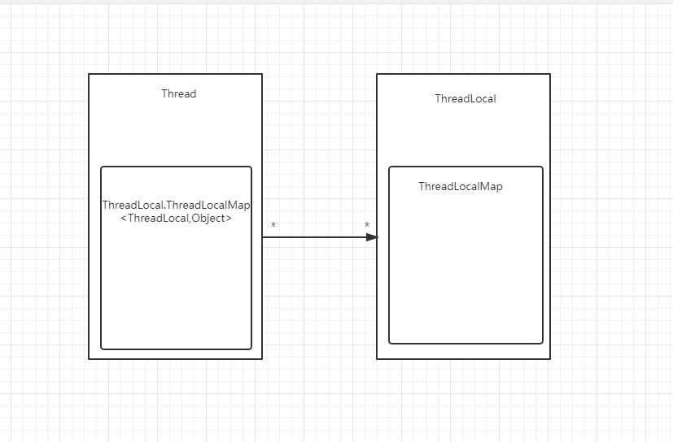

# ThreadLocal源码解读

1. #### Thread ThreadLocalMap ThreadLocal 关系图

   

2. #### ThreadLocal

   ThreadLocal每次初始后threadLocalHashCode增加HASH_INCREMENT

   ```java
   public class MyThreadLocal {	
   	private final int threadLocalHashCode = nextHashCode();
   
       private static AtomicInteger nextHashCode = new AtomicInteger();
   
       private static final int HASH_INCREMENT = 0x61c88647;
   
       private static int nextHashCode() {
           return nextHashCode.getAndAdd(HASH_INCREMENT);
       }
       
       public static void main(String[] args) {
           System.out.println(MyThreadLocal.nextHashCode());
           System.out.println(MyThreadLocal.nextHashCode());
           System.out.println(MyThreadLocal.nextHashCode());
           System.out.println(MyThreadLocal.nextHashCode());
       }
   }
   ```

   ##### 输出结果

   ```java
   0
   1640531527
   -1013904242
   626627285
   ```

   ##### 哈希算法

   ```
   public class MyThreadLocal {
   
       private final int threadLocalHashCode = nextHashCode();
   
       private static final int INITIAL_CAPACITY = 16;
   
       private static AtomicInteger nextHashCode = new AtomicInteger();
   
       private static final int HASH_INCREMENT = 0x61c88647;
   
       private static int nextHashCode() {
           return nextHashCode.getAndAdd(HASH_INCREMENT);
       }
   
       public static void main(String[] args) {
           System.out.println(MyThreadLocal.nextHashCode() & (INITIAL_CAPACITY - 1));
           System.out.println(MyThreadLocal.nextHashCode() & (INITIAL_CAPACITY - 1));
           System.out.println(MyThreadLocal.nextHashCode() & (INITIAL_CAPACITY - 1));
           System.out.println(MyThreadLocal.nextHashCode() & (INITIAL_CAPACITY - 1));
       }
   }
   ```

   ##### 输出结果

   ```
   0
   7
   14
   5
   ```

   ##### 方法

   ```java
    public T get() {
           Thread t = Thread.currentThread();
           // 获取当前线程ThreadLocalMap
           ThreadLocalMap map = getMap(t);
           if (map != null) {
               // 通过当前ThreadLocal的threadLocalHashCode哈希值获取Entry
               ThreadLocalMap.Entry e = map.getEntry(this);
               if (e != null) {
                   @SuppressWarnings("unchecked")
                   T result = (T)e.value;
                   return result;
               }
           }
           return setInitialValue();
    }
   
    public void set(T value) {
           Thread t = Thread.currentThread();
         	// 获取当前线程ThreadLocalMap
           ThreadLocalMap map = getMap(t);
           if (map != null)
             // 通过当前ThreadLocal的threadLocalHashCode哈希值设置Entry
               map.set(this, value);
           else
             // 当前线程没有ThreadLocalMap 场景ThreadLocalMap赋值给Tread
               createMap(t, value);
    }
   
    public void remove() {
            // 获取当前线程ThreadLocalMap
            ThreadLocalMap m = getMap(Thread.currentThread());
            if (m != null)
                // 删除当前线程的ThreadLocal的entry
                m.remove(this);
    } 
   ```

3. ### ThreadLocalMap

   ThreadlocalMap使用   ***线性探测***  解决hash冲突

   ##### 成员变量
   
   ```java
   
           static class Entry extends WeakReference<ThreadLocal<?>> {
               /** The value associated with this ThreadLocal. */
               Object value;
   
               Entry(ThreadLocal<?> k, Object v) {
                   super(k);
                   value = v;
               }
           }
   
           /**
            * The initial capacity -- MUST be a power of two.
            */
           private static final int INITIAL_CAPACITY = 16;
   
           /**
            * The table, resized as necessary.
            * table.length MUST always be a power of two.
            */
           private Entry[] table;
           /**
            * The number of entries in the table.
            */
           private int size = 0;
   
           /**
            * The next size value at which to resize.
            */
        private int threshold; // Default to 0
   ```

   ##### 构造函数
   
   ```java
    ThreadLocalMap(ThreadLocal<?> firstKey, Object firstValue) {
        		// 初始数组化大小
               table = new Entry[INITIAL_CAPACITY];
               // 获取散列值
               int i = firstKey.threadLocalHashCode & (INITIAL_CAPACITY - 1);
               table[i] = new Entry(firstKey, firstValue);
               size = 1;
               // 设置阙值  len * 2 / 3;
               setThreshold(INITIAL_CAPACITY);
        }
   ```

   ##### get方法
   
   ```java 
    private Entry getEntry(ThreadLocal<?> key) {
     			// 获取散列值
               int i = key.threadLocalHashCode & (table.length - 1);
               Entry e = table[i];
               if (e != null && e.get() == key)
                   return e;
               else
                   return getEntryAfterMiss(key, i, e);
    }
   
   /**
    * 查找数组i之后的entry
    */
   private Entry getEntryAfterMiss(ThreadLocal<?> key, int i, Entry e) {
               Entry[] tab = table;
               int len = tab.length;
   
               while (e != null) {
                   ThreadLocal<?> k = e.get();
                   if (k == key)
                       return e;
                   if (k == null)
                       // entrty的key被回收了
                       expungeStaleEntry(i);
                   else
                       // 获取下一个数组的坐标
                       i = nextIndex(i, len);
                   e = tab[i];
               }
               return null;
   }
   
    private int expungeStaleEntry(int staleSlot) {
           ThreadLocal.ThreadLocalMap.Entry[] tab = table;
           int len = tab.length;
   
           // expunge entry at staleSlot
           // 清空该数组位置的entry
           tab[staleSlot].value = null;
           tab[staleSlot] = null;
           size--;
   
           // Rehash until we encounter null
           ThreadLocal.ThreadLocalMap.Entry e;
           int i;
           // 循环staleSlot之后的entry
           for (i = nextIndex(staleSlot, len); (e = tab[i]) != null; i = nextIndex(i, len)) {
               ThreadLocal<?> k = e.get();
               // 清理没有被应用的entry
               if (k == null) {
                   e.value = null;
                   tab[i] = null;
                   size--;
               } else {
                   // 重新计算当前位置ThreadLocal的散列值
                   int h = k.threadLocalHashCode & (len - 1);
                   // 计算后的散列值与当前散列值不相同
                   if (h != i) {
                       // 当前位置的数组设置null
                       tab[i] = null;
                       // Unlike Knuth 6.4 Algorithm R, we must scan until
                       // null because multiple entries could have been stale.
                       // 当前h位置==null设置entey
                       while (tab[h] != null) 
                           // h位置向后移动1位
                           h = nextIndex(h, len);
                       tab[h] = e;
                   }
               }
           }
           return i;
    }
   ```
   
   ##### set方法
   
   ```java
   private void set(ThreadLocal<?> key, Object value) {
           ThreadLocal.ThreadLocalMap.Entry[] tab = table;
           int len = tab.length;
        	// 获取散列值
           int i = key.threadLocalHashCode & (len-1);
   		// 查询i之后entry
           // tab[i]位置有数据处理
           for (ThreadLocal.ThreadLocalMap.Entry e = tab[i]; e != null; e = tab[i = nextIndex(i, len)]) {
               ThreadLocal<?> k = e.get();
               if (k == key) {
                   // 之前的key在值重新赋值
                   e.value = value;
                   return;
               }
   			// tab[i]位置没有ThreadLocal被使用了
               if (k == null) {
                   replaceStaleEntry(key, value, i);
                   return;
               }
           }
   		// 该位置设置最新entrty
           tab[i] = new ThreadLocal.ThreadLocalMap.Entry(key, value);
           int sz = ++size;
           if (!cleanSomeSlots(i, sz) && sz >= threshold)
               // 重新整理table
               rehash();
       }
    private void replaceStaleEntry(ThreadLocal<?> key, Object value, int staleSlot) {
           ThreadLocal.ThreadLocalMap.Entry[] tab = table;
           int len = tab.length;
           ThreadLocal.ThreadLocalMap.Entry e;
           int slotToExpunge = staleSlot;
           // staleSlot 之前位置的entrty
           for (int i = prevIndex(staleSlot, len); (e = tab[i]) != null; i = prevIndex(i, len))
               if (e.get() == null)
                   slotToExpunge = i;
   
           // 重新设置
           for (int i = nextIndex(staleSlot, len); (e = tab[i]) != null; i = nextIndex(i, len)) {
               // 找见之前设置entry设置的位置
               ThreadLocal<?> k = e.get();
               if (k == key) {
                   e.value = value;
   
                   tab[i] = tab[staleSlot];
                   tab[staleSlot] = e;
   
                   // Start expunge at preceding stale entry if it exists
                   if (slotToExpunge == staleSlot)
                       slotToExpunge = i;
                   // 清理无效数组数据
                   cleanSomeSlots(expungeStaleEntry(slotToExpunge), len);
                   return;
               }
               if (k == null && slotToExpunge == staleSlot)
                   slotToExpunge = i;
           }
   
           // If key not found, put new entry in stale slot
           tab[staleSlot].value = null;
           tab[staleSlot] = new ThreadLocal.ThreadLocalMap.Entry(key, value);
   
           // If there are any other stale entries in run, expunge them
           if (slotToExpunge != staleSlot)
               cleanSomeSlots(expungeStaleEntry(slotToExpunge), len);
       }
   
      // 清理该tabl的数据
       private int expungeStaleEntry(int staleSlot) {
           ThreadLocal.ThreadLocalMap.Entry[] tab = table;
           int len = tab.length;
   
           // expunge entry at staleSlot
           tab[staleSlot].value = null;
           tab[staleSlot] = null;
           size--;
   
           // Rehash until we encounter null
           ThreadLocal.ThreadLocalMap.Entry e;
           int i;
           // 清理taba[staleSlot]之后的数据
           for (i = nextIndex(staleSlot, len); (e = tab[i]) != null; i = nextIndex(i, len)) {
               ThreadLocal<?> k = e.get();
               // tab[i]位置没有ThreadLocal被使用了
               if (k == null) {
                   e.value = null;
                   tab[i] = null;
                   size--;
               } else {
                   // 重新计算散列值存放到下一个位置
                   int h = k.threadLocalHashCode & (len - 1);
                   if (h != i) {
                       tab[i] = null;
   
                       // Unlike Knuth 6.4 Algorithm R, we must scan until
                       // null because multiple entries could have been stale.
                       while (tab[h] != null)
                           h = nextIndex(h, len);
                       tab[h] = e;
                   }
               }
           }
           return i;
       }
    /**
     * 清理部分数据 n = n/2 
     */
    private boolean cleanSomeSlots(int i, int n) {
               boolean removed = false;
               Entry[] tab = table;
               int len = tab.length;
               do {
                   i = nextIndex(i, len);
                   Entry e = tab[i];
                   if (e != null && e.get() == null) {
                       n = len;
                       removed = true;
                       i = expungeStaleEntry(i);
                   }
                  //n = n/2 
               } while ( (n >>>= 1) != 0);
               return removed;
           }
    /**
     * 整理数组
     */
    private void rehash() {
                // 清理全部数组
               expungeStaleEntries();
   
               // Use lower threshold for doubling to avoid hysteresis
               // 判断size的值是否大于阙值
               if (size >= threshold - threshold / 4)
                   // 扩容
                   resize();
           }
   
           /**
            * Double the capacity of the table.
            */
           private void resize() {
               Entry[] oldTab = table;
               int oldLen = oldTab.length;
               int newLen = oldLen * 2;
               Entry[] newTab = new Entry[newLen];
               int count = 0;
               // 旧的位置拷贝到行新的位置
               for (int j = 0; j < oldLen; ++j) {
                   Entry e = oldTab[j];
                   if (e != null) {
                       ThreadLocal<?> k = e.get();
                       if (k == null) {
                           e.value = null; // Help the GC
                       } else {
                           int h = k.threadLocalHashCode & (newLen - 1);
                           while (newTab[h] != null)
                               h = nextIndex(h, newLen);
                           newTab[h] = e;
                           count++;
                       }
                   }
               }
   
               setThreshold(newLen);
               size = count;
               table = newTab;
           }
   
           /**
            * Expunge all stale entries in the table.
            * 全部清理数组
            */
           private void expungeStaleEntries() {
               Entry[] tab = table;
               int len = tab.length;
               for (int j = 0; j < len; j++) {
                   Entry e = tab[j];
                   if (e != null && e.get() == null)
                       expungeStaleEntry(j);
               }
           }
       }
   ```
   
   ##### remove方法
   
   ```java
   private void remove(ThreadLocal<?> key) {
               Entry[] tab = table;
               int len = tab.length;
               int i = key.threadLocalHashCode & (len-1);
               // 查询I之后等于key的值并清理
               for (Entry e = tab[i]; e != null;e = tab[i = nextIndex(i, len)]) {
                   if (e.get() == key) {
                       e.clear();
                       expungeStaleEntry(i);
                       return;
                   }
               }
           }
   ```
