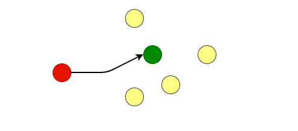
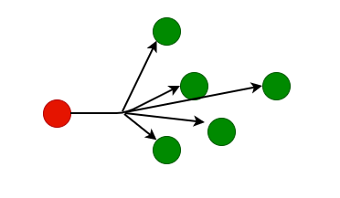
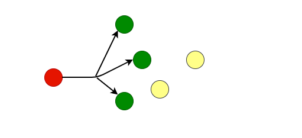

#  IPv4

IPv4地址一共32位，四个字节

#### 1. IP地址的分类

| 类别 | 前缀     | IP范围                    | 网络数量        | 主机数量         |
| :--- | :------- | ------------------------- | --------------- | ---------------- |
| A    | 00000000 | 0.0.0.0-127.255.255.255   | 128(8位）       | 16,777,214(24位) |
| B    | 10000000 | 128.0.0.0-191.255.255.255 | 16,384(16位)    | 65,534(16位)     |
| C    | 11000000 | 192.0.0.0-223.255.255.255 | 2,097,152(24位) | 254(8位)         |
| D    | 11100000 | 224.0.0.0-239.255.255.255 | 未定义          | 未定义           |
| E    | 11110000 | 240.0.0.0-255.255.255.255 | 未定义          | 未定义           |

#### 2. 单播,广播,组播
-    单播： 一对一的通信
     
     
-    广播： 一对所有的通信 
     
     
     eg: C类 192.168.11.0 子网络里 广播地址是192.168.11.255 
     
-    组播： 一对多的通信
     
     
     D类地址做组播组的群名，所有的主机都加入了同一个D类地址, D类地址是虚拟的并没有一个主机是这个IP地址

